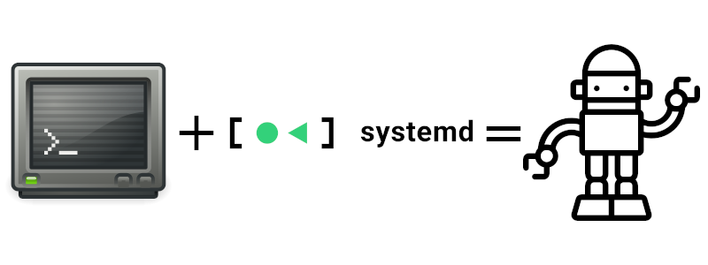

automated-tasks
===============

|buymeacoffee|

A collection of `free software <https://www.gnu.org/philosophy/free-sw.html>`_ 
scripts that I currently use on my computer systems.

.. |buymeacoffee| image:: assets/buy_me_a_coffee.svg
                   :alt: Buy me a coffee
                   :target: https://buymeacoff.ee/frnmst

Documentation
-------------

https://frnmst.github.io/automated-tasks/

License
-------

See the `LICENSE <docs/copyright_license.rst>`_ file.

Asset credits
-------------

- the *Hey! Read this.* image reported here is released under the 
  `CC BY 2.0 license <https://creativecommons.org/licenses/by/2.0/>`_ by
  Michael Downey. See the 
  `original source <https://www.flickr.com/photos/michaeljdowney/2174625842>`_.

- the logo is composed of three pictures:

  - https://commons.wikimedia.org/wiki/File:Systemd-logo.svg

    - `Creative Commons Attribution 3.0 Unported license <https://creativecommons.org/licenses/by/3.0/deed.en>`_
    - `original file <https://upload.wikimedia.org/wikipedia/commons/3/33/Systemd-logo.svg>`_
    - author: ``Tobias Bernard``

  - https://en.wikipedia.org/wiki/File:Gnome-utilities-terminal.svg

    - `Creative Commons Attribution-Share Alike 3.0 Unported license <https://creativecommons.org/licenses/by-sa/3.0/deed.en>`_
    - `original file <https://upload.wikimedia.org/wikipedia/commons/d/da/Gnome-utilities-terminal.svg>`_
    - author: ``GNOME Project``

  - https://commons.wikimedia.org/wiki/File:Big-bot-icon.svg

    - `Creative Commons Attribution 3.0 Unported license <https://creativecommons.org/licenses/by/3.0/deed.en>`_
    - `original file <https://upload.wikimedia.org/wikipedia/commons/d/d8/Big-bot-icon.svg>`_
    - author: ``Robot by Creaticca Creative Agency from the Noun Project``
