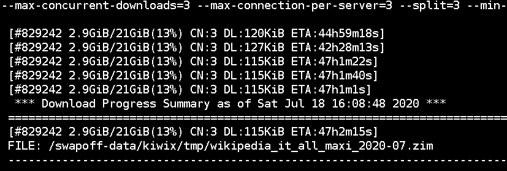
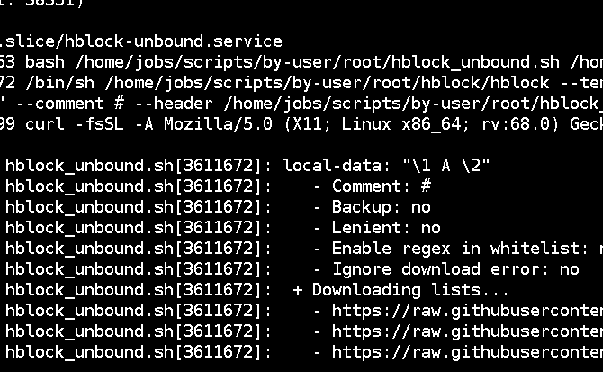
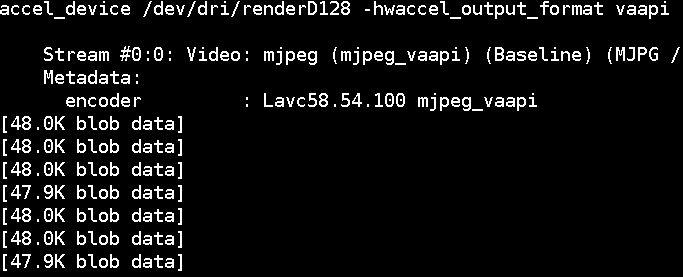

Scripts
=======

The main scripts are located under the ``./src`` directory.

Archiving
---------

archive_documents_simple.sh
```````````````````````````

Purpose
~~~~~~~

I use this script to archive important documents on USB
flash drives just in case all the backups fail or files
are deleted by mistake.

Steps
~~~~~

1. partition and format a USB drive
2. get the filesystem UUID with ``$ lsblk -o name,uuid``

References
~~~~~~~~~~

- https://wiki.archlinux.org/index.php?title=Udisks&oldid=575618#udevadm_monitor

Programming languages
~~~~~~~~~~~~~~~~~~~~~

- bash

Dependencies
~~~~~~~~~~~~

+----------------------+------------+------------------+
| Name                 | Binaries   | Version          |
+======================+============+==================+
| GNU Bash             | - bash     | 5.0.007          |
+----------------------+------------+------------------+
| GNU Coreutils        | - env      | 8.31             |
|                      | - stdbuf   |                  |
|                      | - sync     |                  |
+----------------------+------------+------------------+
| util-linux           | - mount    | 2.34             |
|                      | - umount   |                  |
+----------------------+------------+------------------+
| rsync                | - rsync    | 3.1.3            |
+----------------------+------------+------------------+
| systemd              | - udevadm  | 242.29           |
+----------------------+------------+------------------+

Licenses
~~~~~~~~

- GFDLv1.3+

YAML data
~~~~~~~~~


::


    <--YAML-->
    archive_documents_simple.sh:
        category: archiving
        running user: root
        configuration files:
            paths:
                - archive_documents_simple.myuser.conf
        systemd unit files:
            paths:
                service:
                    - archive-documents-simple.myuser.service
    <!--YAML-->


----

extract_gpx_data_from_dashcams.py
`````````````````````````````````

Purpose
~~~~~~~

I use this script to delete old dashcam footage and replace it with
gpx data extracted from the footage itself. This works
for my *AUKEY DR02 D* dashcam (with its separate GPS unit).
It should work for other dashcams as well.

You can open the generated gpx files with programs like
`GPXSee <https://www.gpxsee.org/>`_
or `GPX-viewer <https://blog.sarine.nl/tag/gpxviewer/>`_.

Steps
~~~~~

1. put the dashcam footage in the appropriate directory
2. edit the ``gpx.fmt`` file if needed

.. important:: do not skip step 2. Read the comments in the file.

References
~~~~~~~~~~

- https://www.topografix.com/gpx_manual.asp
- http://owl.phy.queensu.ca/~phil/exiftool/geotag.html#Inverse
- https://sno.phy.queensu.ca/~phil/exiftool/TagNames/GPS.html
- https://sno.phy.queensu.ca/~phil/exiftool/faq.html

Programming languages
~~~~~~~~~~~~~~~~~~~~~

- python
- perl

Dependencies
~~~~~~~~~~~~

+----------------------+------------+------------------+
| Name                 | Binaries   | Version          |
+======================+============+==================+
| Python               | - python3  | 3.8.5            |
+----------------------+------------+------------------+
| fpyutils             |            | 1.2.0            |
+----------------------+------------+------------------+
| exiftool             | - exiftool | 12.00            |
+----------------------+------------+------------------+

Licenses
~~~~~~~~

- GPLv3+

YAML data
~~~~~~~~~


::


    <--YAML-->
    extract_gpx_data_from_dashcams.py:
        category: archiving
        running user: myuser
        configuration files:
            paths:
                - gpx.fmt
                - extract_gpx_data_from_dashcams.myuser.yaml
        systemd unit files:
            paths:
                service:
                    - extract-gpx-data-from-dashcams.myuser.service
                timer:
                    - extract-gpx-data-from-dashcams.myuser.timer
    <!--YAML-->


----

pdftoocr.sh
```````````

Purpose
~~~~~~~

I use this script to transform paper documents in ocr'd PDFs.

Examples
~~~~~~~~

This script processes one file per directory. The output filename
will be the SHA 1 sum of the directory name. For example, given ``documents/a/out.pdf``,
three files will result:

================================================================    =====================================================================================================================================================================================
File name                                                           Description
================================================================    =====================================================================================================================================================================================
``documents/a/86f7e437faa5a7fce15d1ddcb9eaeaea377667b8.pdf``        the compressed, archivable, grayscaled and OCR'd version of ``out.pdf``
``documents/a/86f7e437faa5a7fce15d1ddcb9eaeaea377667b8.pdf.txt``    a text file of the OCR'd text from ``out.pdf``
``documents/a/SHA512SUMS``                                          a checksum file containing the SHA 512 checksums of ``documents/a/86f7e437faa5a7fce15d1ddcb9eaeaea377667b8.pdf`` and ``documents/a/86f7e437faa5a7fce15d1ddcb9eaeaea377667b8.pdf.txt``
================================================================    =====================================================================================================================================================================================

Infact ``$ echo -n 'a' | sha1sum``
corresponds to ``86f7e437faa5a7fce15d1ddcb9eaeaea377667b8``.

Steps
~~~~~

1. scan documents with ``$ simple-scan``
2. save the output file as ``${OUTPUT_FILE}``
3. if you want to keep colors, run ``$ touch "${COLOR_OVERRIDE_FILE}"`` in
   the directory. This file will be automatically deleted once the script ends.

.. important:: Along with installing the listed dependencies you need to install
               the appropriate Tesseract language data files.

References
~~~~~~~~~~

- https://unix.stackexchange.com/a/93971

Programming languages
~~~~~~~~~~~~~~~~~~~~~

- bash

Dependencies
~~~~~~~~~~~~

+----------------------+---------------+------------------+
| Name                 | Binaries      | Version          |
+======================+===============+==================+
| GNU Bash             | - bash        | 5.0.007          |
+----------------------+---------------+------------------+
| Findutils            | - find        | 4.6.0            |
+----------------------+---------------+------------------+
| Gawk                 | - gawk        | 4.2.1            |
+----------------------+---------------+------------------+
| GNU Coreutils        | - chmod       | 8.31             |
|                      | - cp          |                  |
|                      | - date        |                  |
|                      | - env         |                  |
|                      | - rm          |                  |
|                      | - sha1sum     |                  |
|                      | - sha512sum   |                  |
|                      | - sort        |                  |
|                      | - sync        |                  |
|                      | - tr          |                  |
+----------------------+---------------+------------------+
| Ghostscript          | - gs          | 9.27             |
+----------------------+---------------+------------------+
| OCRmyPDF             | - ocrmypdf    | 8.3.0            |
+----------------------+---------------+------------------+
| Document Scanner     | - simple-scan | 3.36.0           |
+----------------------+---------------+------------------+
| Tesseract OCR        |               | 4.1.1            |
+----------------------+---------------+------------------+

Configuration files
~~~~~~~~~~~~~~~~~~~

.. important:: It is very important to set the ``OCR_LANG`` variable.

Licenses
~~~~~~~~

- CC-BY-SA 3.0

YAML data
~~~~~~~~~


::


    <--YAML-->
    pdftoocr.sh:
        category: archiving
        running user: myuser
        configuration files:
            paths:
                - pdftoocr_deploy.sh
                - pdftoocr_deploy.myuser_documents.conf
                - pdftoocr.myuser_documents.conf
        systemd unit files:
            paths:
                service:
                    - pdftoocr.myuser_documents.service
                timer:
                    - pdftoocr.myuser_documents.timer
    <!--YAML-->


----

youtube_dl.py
`````````````

Purpose
~~~~~~~

I use this script to download and archive videos from various platforms.

Steps
~~~~~

1. get a list of urls and divide them by subject
2. optionally run common command 1

References
~~~~~~~~~~

- https://wiki.archlinux.org/index.php/Youtube-dl
- https://gotify.net/
- https://gotify.net/docs/pushmsg

Programming languages
~~~~~~~~~~~~~~~~~~~~~

- python

Dependencies
~~~~~~~~~~~~

+----------------------+----------------+------------------+
| Name                 | Binaries       | Version          |
+======================+================+==================+
| youtube-dl           | - youtube-dl   | 2020.06.16.1     |
+----------------------+----------------+------------------+
| Python               | - python3      | 3.8.4            |
+----------------------+----------------+------------------+
| aria2                |                | 1.35.0           |
+----------------------+----------------+------------------+
| fpyutils             |                | 1.2.0            |
+----------------------+----------------+------------------+

Configuration files
~~~~~~~~~~~~~~~~~~~

Three files must exist for each subject:

1. the ``*.yaml`` file is a generic configuration file
2. the ``*.options`` file contains most of the options used by ``youtube-dl``
3. the ``*txt`` file contains a list of source URLs

Licenses
~~~~~~~~

- GPLv3+

YAML data
~~~~~~~~~


::


    <--YAML-->
    youtube_dl.py:
        category: archiving
        running user: myuser
        configuration files:
            paths:
                - youtube_dl.some_subject.yaml
                - youtube_dl.some_subject.options
                - youtube_dl.some_subject.txt
        systemd unit files:
            paths:
                service:
                    - youtube-dl.some_subject.service
                timer:
                    - youtube-dl.some_subject.timer
    <!--YAML-->


----

archive_invoice_files.py
````````````````````````

Purpose
~~~~~~~

I use this script to archive and print invoice files.

Invoice files are downloaded from `PEC accounts (certified mail) <https://en.wikipedia.org/wiki/Certified_email>`_ as attachments.
An HTML file corresponding to the XML invoice file is archived and
printed. Finally, a notification is sent to a Gotify instance.
During this process, cryptographical signatures and integrity checks are performed.

Steps
~~~~~

1. Create a new virtual environment as explained in
   `this post <https://frnmst.gitlab.io/notes/running-python-scripts-with-different-package-versions.html>`_,
   and call it ``archive_invoice_files``.

   Once activated you can run this command, tested for ``fattura-elettronica-reader`` version ``2.0.1``:


   ::


       pip3 install requests==2.25 fpyutils==1.2.1 python-dateutil fattura-elettronica-reader WeasyPrint==52.1 pycups==2.0.1 lxml


2. optionally run common command 1

.. important:: To be able to install pycups and to use WeasyPrint, `CUPS <https://www.cups.org/>`_ must be already installed.

.. warning:: If an error similar to this is raised:
             ``UserWarning: FontConfig: No fonts configured. Expect ugly output.``
             , install a font such as `DejaVu <https://dejavu-fonts.github.io/>`_.

References
~~~~~~~~~~

- https://github.com/markuz/scripts/blob/master/getmail.py

Programming languages
~~~~~~~~~~~~~~~~~~~~~

- python

Dependencies
~~~~~~~~~~~~

+----------------------------+------------+------------------+
| Name                       | Binaries   | Version          |
+============================+============+==================+
| Python                     | - python3  | 3.9.0            |
+----------------------------+------------+------------------+
| Requests                   |            | 2.25.0           |
+----------------------------+------------+------------------+
| dateutil                   |            | 2.8.1            |
+----------------------------+------------+------------------+
| lxml                       |            | 4.6.2            |
+----------------------------+------------+------------------+
| pycups                     |            | 2.0.1            |
+----------------------------+------------+------------------+
| WeasyPrint                 |            | 52.1             |
+----------------------------+------------+------------------+
| fattura-elettronica-reader |            | 2.0.1            |
+----------------------------+------------+------------------+
| fpyutils                   |            | 1.2.1            |
+----------------------------+------------+------------------+

Licenses
~~~~~~~~

- GPLv2+
- GPLv3+

YAML data
~~~~~~~~~


::


    <--YAML-->
    archive_invoice_files.py:
        category: archiving
        running user: myuser
        configuration files:
            paths:
                - archive_invoice_files.myuser.yaml
        systemd unit files:
            paths:
                service:
                    - archive-invoice-files.myuser.service
                timer:
                    - archive-invoice-files.myuser.timer
    <!--YAML-->


----


archive_media_files.py
``````````````````````

Purpose
~~~~~~~

I use this script to archive media files, usually photos and
videos (but sometimes also audio files), from removable drives such as SD cards.

Files are archived using this schema:


::


    ${device_uuid}/${year}/${month}


Udisks2 hanged frequently, so I had to write this new script which
uses traditional mount commands. Parallelization of rsync and of metadata
extraction was also added.

Steps
~~~~~

1. get a device with media files
2. get the filesystem UUID with: ``$ lsblk -o name,uuid``
3. get the user id and group id of the user corresponding to the
   path where the files will be archived

References
~~~~~~~~~~

- https://wiki.archlinux.org/index.php?title=Udisks&oldid=575618#udevadm_monitor
- https://github.com/frnmst/automated-tasks/blob/67415cdd7224ff21a2f39bb8180ee36cf6e6e31e/archiving/archive_documents_simple.sh
- https://frnmst.gitlab.io/notes/automatic-removable-media-synchronization.html

Programming languages
~~~~~~~~~~~~~~~~~~~~~

- python

Dependencies
~~~~~~~~~~~~

+----------------------+------------+------------------+
| Name                 | Binaries   | Version          |
+======================+============+==================+
| Python               | - python3  | 3.8.5            |
+----------------------+------------+------------------+
| exiftool             | - exiftool | 12.00            |
+----------------------+------------+------------------+
| fpyutils             |            | 1.2.0            |
+----------------------+------------+------------------+
| pyudev               |            | 0.22.3           |
+----------------------+------------+------------------+

Licenses
~~~~~~~~

- GFDLv1.3+

YAML data
~~~~~~~~~


::


    <--YAML-->
    archive_media_files.py:
        category: archiving
        running user: root
        configuration files:
            paths:
                - archive_media_files.mypurpose.yaml
        systemd unit files:
            paths:
                service:
                    - archive-media-files.mypurpose.service
    <!--YAML-->


----

archive_emails.py
`````````````````

Purpose
~~~~~~~

I use this script to get a local copy of all my emails.

References
~~~~~~~~~~

- https://wiki.archlinux.org/index.php/OfflineIMAP
- https://github.com/OfflineIMAP/offlineimap/blob/master/offlineimap.conf

Programming languages
~~~~~~~~~~~~~~~~~~~~~

- python

Dependencies
~~~~~~~~~~~~

+----------------------+---------------+------------------+
| Name                 | Binaries      | Version          |
+======================+===============+==================+
| Python               | - python3     | 3.8.5            |
+----------------------+---------------+------------------+
| fpyutils             |               | 1.2.0            |
+----------------------+---------------+------------------+
| OfflineIMAP          | - offlineimap | 7.3.3            |
+----------------------+---------------+------------------+

Licenses
~~~~~~~~

- GFDLv1.3+

YAML data
~~~~~~~~~


::


    <--YAML-->
    archive_emails.py:
        category: archiving
        running user: myuser
        configuration files:
            paths:
                - archive_emails.myuser.yaml
                - archive_emails.myuser.options
        systemd unit files:
            paths:
                service:
                    - archive-emails.myuser.service
                timer:
                    - archive-emails.myuser.timer
    <!--YAML-->


----

archive_media_with_label.py
```````````````````````````

Purpose
~~~~~~~

I use this script to add a label to phjysical supports sucs as tapes, CDs, etc...

Steps
~~~~~

1. run the program with the appriopriate parameters
2. rename the file
3. print or write down the label and stick it on the media
4. once you have filled a box, print or write down all the labels as a single one
   and stick it on the box

Programming languages
~~~~~~~~~~~~~~~~~~~~~

- python

Dependencies
~~~~~~~~~~~~

+----------------------+------------+------------------+
| Name                 | Binaries   | Version          |
+======================+============+==================+
| python-tabulate      |            | 0.8.7            |
+----------------------+------------+------------------+
| fpyutils             |            | 1.2.0            |
+----------------------+------------+------------------+

Licenses
~~~~~~~~

- GPLv3+

YAML data
~~~~~~~~~


::


    <--YAML-->
    archive_media_with_label.py:
        category: archiving
        running user: myuser
        configuration files:
            paths:
                - archive_media_with_label.yaml
    <!--YAML-->

----

Audio
------

set-turntable-loopback-sound.service
````````````````````````````````````

Purpose
~~~~~~~

I use this script to enable the loopback sound of a
SONY PS-LX300USB turntable.

Steps
~~~~~

1. connect the turntable via USB 2.0 type B to the computer

Programming languages
~~~~~~~~~~~~~~~~~~~~~

- bash

Dependencies
~~~~~~~~~~~~

+----------------------+------------+------------------+
| Name                 | Binaries   | Version          |
+======================+============+==================+
| GNU Bash             | - bash     | 5.0.007          |
+----------------------+------------+------------------+
| alsa-utils           | - arecord  | 1.1.9            |
|                      | - aplay    |                  |
+----------------------+------------+------------------+

Configuration files
~~~~~~~~~~~~~~~~~~~

To avoid ``aplay`` bloking the output, configure ALSA with
dmix PCMs. Use `aplay -l` to find the device names.

In my case I also want to duplicate the analog and HDMI output but
there is, however, a slight delay of the HDMI audio.

Licenses
~~~~~~~~

- CC-BY-SA 3.0

YAML data
~~~~~~~~~


::


    <--YAML-->
    set-turntable-loopback-sound.service:
        category: audio
        running user: mydesktopuser
        configuration files:
            paths:
                - set-turntable-loopback-sound.asoundrc
        systemd unit files:
            paths:
                service:
                    - set-turntable-loopback-sound.service
    <!--YAML-->


----

Backups
-------

borgmatic_hooks.py
``````````````````

Purpose
~~~~~~~

I use this script to send notifications during hard drive backups.

A script to mount the backed up archives is also included here.

Steps
~~~~~

1. create a new borg repository

   .. note:: We want to avoid encryption because:

             1. it works with older versions of borg
             2. it is simpler
             3. these are not offsite backups

   .. important:: There are two different types of setups: local and remote repositories.

   .. note:: We will assume that:

             - our source directory is a mountpoint at ``/backed/up/mountpoint``. This makes sense if we want to backup ``/root`` or ``/home`` for example.
             - our borg directories will be under ``/mnt/backups``

             For example, if we want to backup ``/home`` and our hostname is ``mypc`` we would have: ``/mnt/backups/mypc_home.borg``


   To create a local repository run:

   ::


       $ borg init -e none /mnt/backups/myhostname_backed_up_mountpoint.borg


   For remote repositories run common command 1 using ``borgmatic`` as parameter
   on the destination (backup) server. Create an SSH key pair so that you can connect to the
   destination server. On the source server run:


   ::


       $ borg init -e none user@host:/mnt/backups/myhostname_backed_up_mountpoint.borg


2. edit the Borgmatic YAML configuration file

References
~~~~~~~~~~

- https://torsion.org/borgmatic/
- https://torsion.org/borgmatic/docs/how-to/monitor-your-backups/
- https://torsion.org/borgmatic/docs/how-to/deal-with-very-large-backups/
- https://borgbackup.readthedocs.io/en/stable/usage/init.html?highlight=encryption
- https://medspx.fr/projects/backup/
- https://borgbackup.readthedocs.io/en/stable/deployment/image-backup.html
- https://projects.torsion.org/witten/borgmatic/raw/branch/master/sample/systemd/borgmatic.service
- https://projects.torsion.org/witten/borgmatic/raw/branch/master/sample/systemd/borgmatic.timer
- https://superuser.com/questions/1016827/how-do-i-run-a-script-before-everything-else-on-shutdown-with-systemd

Programming languages
~~~~~~~~~~~~~~~~~~~~~

- bash

Dependencies
~~~~~~~~~~~~

+----------------------+-------------+------------------+
| Name                 | Binaries    | Version          |
+======================+=============+==================+
| Python               | - python3   | 3.8.5            |
+----------------------+-------------+------------------+
| fpyutils             |             | 1.2.0            |
+----------------------+-------------+------------------+
| borgmatic            | - borgmatic | 1.5.9            |
+----------------------+-------------+------------------+
| Python-LLFUSE        |             | 1.3.6            |
+----------------------+-------------+------------------+

Configuration files
~~~~~~~~~~~~~~~~~~~

I use a set of configuration files per mountpoint to back up.

Systemd unit files
~~~~~~~~~~~~~~~~~~

I use a set of configuration files per mountpoint to back up.

To mount all the archives of a borg backup you simply must run the borgmatic-mount service.
To unmount them stop the service.

.. tip:: You can use this systemd service unit file to backup when the computer shuts down.

   When my computer shuts down my home directory gest backed up on the server.
   What I need are the configuration and *normal* files: I don't care about ``~/.cache``,
   the shell history nor the browser's history and cache. You should edit the
   configuration file to reflect that.

   Although this service remains active all the time, the syncronization action
   runs when the system is halted using an ``ExecStop`` directive. Since we don't
   know how much time the syncronization takes a ``TimeoutStopSec=infinity``
   directive is present.

   ::


    #
    # borgmatic.myhostname_backed_up_mountpoint.service
    #
    # Copyright (C) 2016-2020 Dan Helfman <https://projects.torsion.org/witten/borgmatic/raw/branch/master/sample/systemd/borgmatic.service>
    #               2020 Franco Masotti <franco.masotti@live.com>
    #
    # This program is free software: you can redistribute it and/or modify
    # it under the terms of the GNU General Public License as published by
    # the Free Software Foundation, either version 3 of the License, or
    # (at your option) any later version.
    #
    # This program is distributed in the hope that it will be useful,
    # but WITHOUT ANY WARRANTY; without even the implied warranty of
    # MERCHANTABILITY or FITNESS FOR A PARTICULAR PURPOSE.  See the
    # GNU General Public License for more details.
    #
    # You should have received a copy of the GNU General Public License
    # along with this program.  If not, see <https://www.gnu.org/licenses/>.

    # See https://superuser.com/questions/1016827/how-do-i-run-a-script-before-everything-else-on-shutdown-with-systemd
    #
    # Copyright (C) 2015 le_me @ Stack Overflow (https://superuser.com/a/1016848)
    # Copyright (C) 2017 Community @ Stack Overflow (https://superuser.com/a/1016848)
    # Copyright (C) 2020 Franco Masotti <franco.masotti@live.com>
    #
    # This script is licensed under a
    # Creative Commons Attribution-ShareAlike 3.0 International License.
    #
    # You should have received a copy of the license along with this
    # work. If not, see <http://creativecommons.org/licenses/by-sa/3.0/>.

    [Unit]
    Description=borgmatic myhostname_backed_up_mountpoint backuup
    Wants=network-online.target
    After=network-online.target
    ConditionACPower=true
    Requires=backed-up-mountpoint.mount
    Requires=mnt-backups-myhostname_backed_up_mountpoint.mount
    After=backed-up-mountpoint.mount
    After=mnt-backups-myhostname_backed_up_mountpoint.mount

    [Service]
    Type=oneshot

    # Lower CPU and I/O priority.
    Nice=19
    CPUSchedulingPolicy=batch
    IOSchedulingClass=best-effort
    IOSchedulingPriority=7
    IOWeight=100

    # Do not Retry.
    Restart=no

    # Prevent rate limiting of borgmatic log events. If you are using an older version of systemd that
    # doesn't support this (pre-240 or so), you may have to remove this option.
    LogRateLimitIntervalSec=0

    ExecStart=/bin/true
    RemainAfterExit=yes
    TimeoutStopSec=infinity
    ExecStop=/usr/bin/borgmatic --config /home/jobs/scripts/by-user/root/borgmatic.myhostname_backed_up_mountpoint.yaml --syslog-verbosity 1

    User=root
    Group=root

    [Install]
    WantedBy=multi-user.target


Licenses
~~~~~~~~

- GPLv3+

YAML data
~~~~~~~~~


::


    <--YAML-->
    borgmatic_hooks.py:
        category: backups
        running user: root
        configuration files:
            paths:
                - borgmatic.myhostname_backed_up_mountpoint.yaml
                - borgmatic_hooks.myhostname_backed_up_mountpoint.yaml
                - borgmatic_mount.myhostname_backed_up_mountpoint.yaml
        systemd unit files:
            paths:
                service:
                    - borgmatic.myhostname_backed_up_mountpoint.service
                    - borgmatic-mount.myhostname_backed_up_mountpoint.service
                timer:
                    - borgmatic.myhostname_backed_up_mountpoint.timer
    <!--YAML-->


----

android_phone_backup.sh
```````````````````````

Purpose
~~~~~~~

I use this script to backup Android phones.

Steps
~~~~~

1. set a fixed IP address on the Android phone
2. install `Primitive FTPd <https://github.com/wolpi/prim-ftpd>`_ from `F-Droid <https://f-droid.org/en/packages/org.primftpd/>`_
3. open Primitive FTPd and set the ``Storage Type`` to ``Read only SAF (faster!)``

  .. important:: If this does not work for your phone try a different ``Storage Type``.

4. tap the settings icon and set these fields:

  - ``Username``
  - ``Password``
  - ``Secure Port``

5. enable these fields as well:

  - ``Prevent Standby``

6. run the server by tapping on the play button

7. test a connection with:


  ::


      ssh -p ${Secure Port} ${Username}@${Android phone IP address}


  You should get:


  ::


      shell request failed on channel 0


.. note:: The values used in these steps must be the same as the one used in the
          configuration file.

References
~~~~~~~~~~

- https://gist.github.com/mfellner/5743990#gistcomment-1839719

Programming languages
~~~~~~~~~~~~~~~~~~~~~

- bash

Dependencies
~~~~~~~~~~~~

+----------------------+---------------+------------------+
| Name                 | Binaries      | Version          |
+======================+===============+==================+
| curl                 | - curl        | 7.69.1           |
+----------------------+---------------+------------------+
| GNU Bash             | - bash        | 5.0.016          |
+----------------------+---------------+------------------+
| GNU Coreutils        | - chmod       | 8.31             |
|                      | - mkdir       |                  |
+----------------------+---------------+------------------+
| GNU Grep             | - grep        | 3.4              |
+----------------------+---------------+------------------+
| libfuse              | - fusermount3 | 1.4.21           |
+----------------------+---------------+------------------+
| rsync                | - rsync       | 3.1.3            |
+----------------------+---------------+------------------+
| SSHFS                | - sshfs       | 3.7.0            |
+----------------------+---------------+------------------+
| util-linux           | - mount       | 2.35             |
+----------------------+---------------+------------------+

Systemd unit files
~~~~~~~~~~~~~~~~~~

.. note:: At your discression keep or remove the ``Requires`` and ``After`` directives
          in the service unit file.

Licenses
~~~~~~~~

- GPLv3+

YAML data
~~~~~~~~~


::


    <--YAML-->
    android_phone_backup.sh:
        category: backups
        running user: myuser
        configuration files:
            paths:
                - android_phone_backup.myuser.conf
        systemd unit files:
            paths:
                service:
                    - android-phone-backup.myuser.service
                timer:
                    - android-phone-backup.myuser.timer
    <!--YAML-->


----

Desktop
-------

random_wallpaper.sh
```````````````````

Purpose
~~~~~~~

I use this to automatically change wallpaper every few minutes.

References
~~~~~~~~~~

- https://linuxdifficile.wordpress.com/2014/04/24/sfondo-desktop-dinamico-per-linux/

Programming languages
~~~~~~~~~~~~~~~~~~~~~

- bash

Dependencies
~~~~~~~~~~~~

+----------------------+------------+------------------+
| Name                 | Binaries   | Version          |
+======================+============+==================+
| GNU Bash             | - bash     | 5.0.007          |
+----------------------+------------+------------------+
| GNU Coreutils        | - shuf     | 8.31             |
+----------------------+------------+------------------+
| feh                  | - feh      | 3.2              |
+----------------------+------------+------------------+

Configuration files
~~~~~~~~~~~~~~~~~~~

Only 1 URL or path is allowed per line. feh will raise an error
if an empty line is parsed.

.. important:: The configuration file must contain only URLs or paths.

.. warning:: No filtering is performed for the configuration file. It is your responsability
             for its content.

Licenses
~~~~~~~~

- CC-BY-SA 2.5

YAML data
~~~~~~~~~


::


    <--YAML-->
    random_wallpaper.sh:
        category: desktop
        running user: mydesktopuser
        configuration files:
            paths:
                - random_wallpaper.conf
        systemd unit files:
            paths:
                service:
                    - random-wallpaper.service
                timer:
                    - random-wallpaper.timer
    <!--YAML-->


----

set_display_gamma.sh
````````````````````

Purpose
~~~~~~~

I use this to automatically set a better gamma for the output on a tv.

References
~~~~~~~~~~

- https://askubuntu.com/a/62270

Programming languages
~~~~~~~~~~~~~~~~~~~~~

- bash

Dependencies
~~~~~~~~~~~~

+----------------------+------------+------------------+
| Name                 | Binaries   | Version          |
+======================+============+==================+
| GNU Bash             | - bash     | 5.0.007          |
+----------------------+------------+------------------+
| Xorg                 | - xrandr   | 1.5.0            |
+----------------------+------------+------------------+

Configuration files
~~~~~~~~~~~~~~~~~~~

Make sure that the ``XORG_DISPLAY`` variable is set correctly.

To find out the current display variable run ``$ echo ${DISPLAY}``

Licenses
~~~~~~~~

- CC-BY-SA 3.0

YAML data
~~~~~~~~~


::


    <--YAML-->
    set_display_gamma.sh:
        category: desktop
        running user: mydesktopuser
        configuration files:
            paths:
                - set_display_gamma.TV_HDMI1.conf
        systemd unit files:
            paths:
                service:
                    - set-display-gamma.service
                timer:
                    - set-display-gamma.timer
    <!--YAML-->


----

Drives
------

smartd_test.py
``````````````

Purpose
~~~~~~~

I use this to run periodical S.M.A.R.T. tests on the hard drives.

Steps
~~~~~

1. run ``# hdparm -I ${drive}`` and compare the results with
   ``$ ls /dev/disk/by-id`` to know which drive corresponds to the
   one you want to work on
2. optionally run common command 1

.. important:: To avoid tests being interrupted you must avoid putting the
               disks to sleep, therefore, programs like
               `hd-idle <https://hd-idle.sourceforge.net/>`_ must be stopped
               before running the tests.

References
~~~~~~~~~~

Programming languages
~~~~~~~~~~~~~~~~~~~~~

- python

Dependencies
~~~~~~~~~~~~

+----------------------+------------+------------------+
| Name                 | Binaries   | Version          |
+======================+============+==================+
| Python               | - python3  | 3.7.4            |
+----------------------+------------+------------------+
| Smartmontools        | - smartctl | 7.0              |
+----------------------+------------+------------------+
| fpyutils             |            | 1.2.0            |
+----------------------+------------+------------------+

Configuration files
~~~~~~~~~~~~~~~~~~~

The script supports only ``/dev/disk/by-id`` names.

See also the udev rule file ``/lib/udev/rules.d/60-persistent-storage.rules``.

Systemd unit files
~~~~~~~~~~~~~~~~~~

I use one file per drive so I can control when a certain drive
performs testing, instead of running them all at once.

Licenses
~~~~~~~~

- GPLv3+

YAML data
~~~~~~~~~


::


    <--YAML-->
    smartd_test.py:
        category: drives
        running user: root
        configuration files:
            paths:
                - smartd_test.yaml
        systemd unit files:
            paths:
                service:
                    - smartd-test.ata_disk1.service
                timer:
                    - smartd-test.ata_disk1.timer
    <!--YAML-->


----

mdamd_check.py
``````````````

Purpose
~~~~~~~

I use this to run periodical RAID data scrubs on the hard drives.

Steps
~~~~~

1. run ``$ lsblk`` to know the names of the mdadm devices. See also: ``$ cat /proc/mdstat``
2. optionally run common command 1

References
~~~~~~~~~~

- https://frnmst.gitlab.io/notes/raid-data-scrubbing.html

Programming languages
~~~~~~~~~~~~~~~~~~~~~

- python

Dependencies
~~~~~~~~~~~~

+----------------------+------------+------------------+
| Name                 | Binaries   | Version          |
+======================+============+==================+
| Python               | - python3  | 3.7.3            |
+----------------------+------------+------------------+
| fpyutils             |            | 1.2.0            |
+----------------------+------------+------------------+

Licenses
~~~~~~~~

- GPLv2+

YAML data
~~~~~~~~~


::


    <--YAML-->
    mdamd_check.py:
        category: drives
        running user: root
        configuration files:
            paths:
                - mdadm_check.yaml
        systemd unit files:
            paths:
                service:
                    - mdamd-check.service
                timer:
                    - mdamd-check.timer
    <!--YAML-->


----

xfs_defrag.py
`````````````

Purpose
~~~~~~~

I use this script to run periodic defragmentations on XFS filesystems.

Steps
~~~~~

1. run ``$ lsblk -o name,uuid`` and get the UUID of the partition you want to defragment
2. optionally run common command 1

References
~~~~~~~~~~

- https://brashear.me/blog/2017/07/30/adventures-in-xfs-defragmentation/

Programming languages
~~~~~~~~~~~~~~~~~~~~~

- python

Dependencies
~~~~~~~~~~~~

+----------------------+------------+------------------+
| Name                 | Binaries   | Version          |
+======================+============+==================+
| Python               | - python3  | 3.8.0            |
+----------------------+------------+------------------+
| util-linux           | - lsblk    | 2.34             |
+----------------------+------------+------------------+
| fpyutils             |            | 1.2.0            |
+----------------------+------------+------------------+

Configuration files
~~~~~~~~~~~~~~~~~~~

This script supports only ``/dev/disk/by-uuid`` names.

Licenses
~~~~~~~~

- GPLv3+

YAML data
~~~~~~~~~


::


    <--YAML-->
    xfs_defrag.py:
        category: drives
        running user: root
        configuration files:
            paths:
                - xfs_defrag.conf
        systemd unit files:
            paths:
                service:
                    - xfs-defrag.my_uuid.service
                timer:
                    - xfs-defrag.my_uuid.timer
    <!--YAML-->


----

File sharing
------------

rtorrent
````````

Purpose
~~~~~~~

I use this to automatically start and manage the torrents.

Steps
~~~~~

1. run common command 0 using ``rtorrent`` as parameter
2. copy the provided configuration file into ``/home/rtorrent/.rtorrent.rc``

References
~~~~~~~~~~

- https://wiki.archlinux.org/index.php/RTorrent#With_screen

Programming languages
~~~~~~~~~~~~~~~~~~~~~

- bash

Dependencies
~~~~~~~~~~~~

+----------------------+----------------+------------------+
| Name                 | Binaries       | Version          |
+======================+================+==================+
| RTorrent             | - rtorrent     | 0.9.8            |
+----------------------+----------------+------------------+
| GNU Screen           | - screen       | 4.8.0            |
+----------------------+----------------+------------------+

Configuration files
~~~~~~~~~~~~~~~~~~~

.. warning:: The provided configuration file is based on an old version of RTorrent.
             Some parameters might be deprecated.

.. note:: It is assumed that the downloaded files are
          placed under ``/data/incoming_torrents``.

Licenses
~~~~~~~~

- GFDLv1.3+

YAML data
~~~~~~~~~


::


    <--YAML-->
    rtorrent:
        category: file-sharing
        running user: rtorrent
        configuration files:
            paths:
                - rtorrent.rc
        systemd unit files:
            paths:
                service:
                    - rtorrent.service
    <!--YAML-->


----

kiwix_manage.py
```````````````




Purpose
~~~~~~~

I use this to download and read Wikipedia as well as other websites offline.

Steps
~~~~~

1. run common command 2 using ``kiwix`` as parameter

References
~~~~~~~~~~

- https://www.kiwix.org/en/
- https://download.kiwix.org/zim/
- https://stackoverflow.com/a/39217788
- https://stackoverflow.com/a/53811881
- https://docs.python.org/3/library/shutil.html?highlight=shutil#shutil.rmtree.avoids_symlink_attacks

Programming languages
~~~~~~~~~~~~~~~~~~~~~

- python

Dependencies
~~~~~~~~~~~~

+----------------------+----------------+------------------+
| Name                 | Binaries       | Version          |
+======================+================+==================+
| Python               | - python3      | 3.8.2            |
+----------------------+----------------+------------------+
| Requests             |                | 2.23.0           |
+----------------------+----------------+------------------+
| BeautifulSoup        |                | 4.8.0            |
+----------------------+----------------+------------------+
| PyYAML               |                | 4.8.2            |
+----------------------+----------------+------------------+
| aria2                | - aria2c       | 1.35.0           |
+----------------------+----------------+------------------+
| Kiwix tools          | - kiwix-serve  | 3.0.1            |
+----------------------+----------------+------------------+
| fpyutils             |                | 1.2.0            |
+----------------------+----------------+------------------+

Configuration files
~~~~~~~~~~~~~~~~~~~

It is recommended to use aria2c instead of requests as downloader. aria2c infact supports
bandwidth throttling and continuation from interrupted downloads.

Systemd unit files
~~~~~~~~~~~~~~~~~~

.. important:: After downloading a new file you must rerun ``kiwix-manage.serve.service``.

Licenses
~~~~~~~~

- GPLv3+
- CC-BY-SA 4.0

YAML data
~~~~~~~~~


::


    <--YAML-->
    kiwix_manage.py:
        category: file-sharing
        running user: kiwix
        configuration files:
            paths:
                - kiwix-manage.yaml
        systemd unit files:
            paths:
                service:
                    - kiwix-manage.download.service
                    - kiwix-manage.serve.service
                timer:
                    - kiwix-manage.download.timer
    <!--YAML-->


----

Misc
----

vdirsyncer
``````````

Purpose
~~~~~~~

I use this to automatically syncronize my calendars and contacts.

Steps
~~~~~

1. setup Vdirsyncer and you clients

.. important:: It is assumed that a CalDAV and CardDAV server
               is running and you can connect to it.

.. note:: In my case I use `Radicale <https://radicale.org>`_ as server and `Khal <https://lostpackets.de/khal/>`_ and `Todoman <https://github.com/pimutils/todoman>`_ as clients.

References
~~~~~~~~~~

- http://vdirsyncer.pimutils.org/en/stable/tutorials/systemd-timer.html

Programming languages
~~~~~~~~~~~~~~~~~~~~~

- bash

Dependencies
~~~~~~~~~~~~

+----------------------+----------------+------------------+
| Name                 | Binaries       | Version          |
+======================+================+==================+
| Vdirsyncer           | - vdirsyncer   | 0.16.7           |
+----------------------+----------------+------------------+

Licenses
~~~~~~~~

- BSD

YAML data
~~~~~~~~~


::


    <--YAML-->
    vdirsyncer:
        category: misc
        running user: myuser
        systemd unit files:
            paths:
                service:
                    - vdirsyncer.service
                timer:
                    - vdirsyncer.timer
    <!--YAML-->


----

monitor_and_notify_git_repo_changes.sh
``````````````````````````````````````

Purpose
~~~~~~~

My `Gitea <https://gitea.io/en-us/>`_ instance is configured to mirror
some repositories. Every 30 minutes this script checks for new
commits in those bare git repositories. If something new
is commited a notification is sent to my `Gotify <https://github.com/gotify/server>`_
instance.

.. note:: This script also works for non-bare git repositories.

Steps
~~~~~

1. run common command 1

References
~~~~~~~~~~

- https://gitea.io/en-us/
- https://gotify.net/
- https://gotify.net/docs/pushmsg

Programming languages
~~~~~~~~~~~~~~~~~~~~~

- bash

Dependencies
~~~~~~~~~~~~

+----------------------+------------+------------------+
| Name                 | Binaries   | Version          |
+======================+============+==================+
| GNU Bash             | - bash     | 5.0.007          |
+----------------------+------------+------------------+
| curl                 | - curl     | 7.66.0           |
+----------------------+------------+------------------+
| Git                  | - git      | 2.23.0           |
+----------------------+------------+------------------+

Configuration files
~~~~~~~~~~~~~~~~~~~

To avoid missing or reading duplicate messages, the variable
``CHECK_TIMEOUT_INTERVAL_SECONDS`` should be set
to the same value as the one in the systemd timer unit
file (``OnCalendar``).

Licenses
~~~~~~~~

- GPLv3+

YAML data
~~~~~~~~~


::


    <--YAML-->
    monitor_and_notify_git_repo_changes.sh:
        category: misc
        running user: gitea
        configuration files:
            paths:
                - monitor_and_notify_git_repo_changes.myrepos.conf
        systemd unit files:
            paths:
                service:
                    - monitor-and-notify-git-repo-changes.myrepos.service
                timer:
                    - monitor-and-notify-git-repo-changes.myrepos.timer
    <!--YAML-->


----

yacy
````

Purpose
~~~~~~~

A personal search engine.

Steps
~~~~~

1. setup `YaCy <https://yacy.net/index.html>`_ and run an instance

.. note:: To install YaCy you need the `OpenJDK Java 13 headless runtime environment <https://openjdk.java.net/>`_ package.

2. run common command 2 using ``yacy`` as parameter
3. clone the YaCy search server repository into ``/home/yacy``:


  ::


      $ git clone https://github.com/yacy/yacy_search_serve.git


References
~~~~~~~~~~

- https://yacy.net/index.html
- https://github.com/yacy/yacy_search_server

Programming languages
~~~~~~~~~~~~~~~~~~~~~

- bash
- java

Dependencies
~~~~~~~~~~~~

+----------------------+----------------+------------------+
| Name                 | Binaries       | Version          |
+======================+================+==================+
| YaCy                 | - startYACY.sh |                  |
|                      | - stopYACY.sh  |                  |
+----------------------+----------------+------------------+

Licenses
~~~~~~~~

- LGPLv2+

YAML data
~~~~~~~~~


::


    <--YAML-->
    yacy:
        category: misc
        running user: yacy
        systemd unit files:
            paths:
                service:
                    - yacy-search-server.service
    <!--YAML-->


----


notify_camera_action.py
```````````````````````

Purpose
~~~~~~~

Notify when a camera connected to a system running `Motion <https://motion-project.github.io/>`_
is found or lost (disconnected).

.. important:: We will assume that a `Motion <https://motion-project.github.io/>`_
               instance is configured and running.

Steps
~~~~~

1. edit a camera's configuration file with:


  ::


      # Run camera actions.
      on_camera_lost /home/jobs/scripts/by-user/motion/notify_camera_action.py /home/jobs/scripts/by-user/motion/notify_camera_action.yaml "%$ (id: %t)" "lost"
      on_camera_found /home/jobs/scripts/by-user/motion/notify_camera_action.py /home/jobs/scripts/by-user/motion/notify_camera_action.yaml "%$ (id: %t)" "found"


2. optionally run common command 1

References
~~~~~~~~~~

- https://motion-project.github.io/motion_config.html

Programming languages
~~~~~~~~~~~~~~~~~~~~~

- bash

Dependencies
~~~~~~~~~~~~

+----------------------+------------+------------------+
| Name                 | Binaries   | Version          |
+======================+============+==================+
| Python               | - python3  | 3.8.5            |
+----------------------+------------+------------------+
| fpyutils             |            | 1.2.0            |
+----------------------+------------+------------------+

Configuration files
~~~~~~~~~~~~~~~~~~~

A single file is used for all the cameras connected to a system.

Licenses
~~~~~~~~

- GPLv3+

YAML data
~~~~~~~~~


::


    <--YAML-->
    notify_camera_action.py:
        category: misc
        running user: motion
        configuration files:
            paths:
                - notify_camera_action.yaml
    <!--YAML-->


----

System
------

hblock_unbound.sh
`````````````````



Purpose
~~~~~~~

I use this script to block malicious domains at a DNS level for the whole
internal network.

.. important:: We will assume that `Unbound <https://nlnetlabs.nl/projects/unbound/about/>`_
               is configured and running.

Steps
~~~~~

1. separate Unbound's configuration into a header and footer file.
   Have a look at the provided configuration files.
2. clone the hblock repository: ``$ git clone https://github.com/hectorm/hblock.git``

References
~~~~~~~~~~

- https://github.com/hectorm/hblock

Programming languages
~~~~~~~~~~~~~~~~~~~~~

- python

Dependencies
~~~~~~~~~~~~

+----------------------+------------+------------------+
| Name                 | Binaries   | Version          |
+======================+============+==================+
| Unbound              | - unbound  | 1.12.0           |
+----------------------+------------+------------------+
| Git                  | - git      | 2.29.2           |
+----------------------+------------+------------------+
| hblock               | - hblock   | v3.1.0           |
+----------------------+------------+------------------+
| GNU Make             | - make     | 4.3              |
+----------------------+------------+------------------+
| fpyutils             |            | 1.2.0            |
+----------------------+------------+------------------+
| Python               | - python3  | 3.8.6            |
+----------------------+------------+------------------+

Configuration files
~~~~~~~~~~~~~~~~~~~

In case something goes wrong you can use this fallback command:

::


    # cat hblock_unbound.header.conf hblock_unbound.footer.conf > /etc/unbound/unbound.conf


.. note:: The provided configuration files are designed to work
          along with `dnscrypt-proxy 2 <https://github.com/jedisct1/dnscrypt-proxy>`_

Licenses
~~~~~~~~

- MIT

YAML data
~~~~~~~~~


::


    <--YAML-->
    hblock_unbound.py:
        category: system
        running user: root
        configuration files:
            paths:
                - hblock_unbound.yaml
                - hblock_unbound.footer.conf
                - hblock_unbound.header.conf
                - hblock_unbound.post_commands.conf
        systemd unit files:
            paths:
                service:
                    - hblock-unbound.service
                timer:
                    - hblock-unbound.timer
    <!--YAML-->


----

clean_pacman.sh
```````````````

Purpose
~~~~~~~

I use this very simple script to clean the cache generated by `Pacman <https://www.archlinux.org/pacman/>`_.

References
~~~~~~~~~~

- https://wiki.archlinux.org/index.php/Pacman#Cleaning_the_package_cache
- https://wiki.archlinux.org/index.php/Pacman/Tips_and_tricks#Removing_unused_packages_.28orphans.29

Programming languages
~~~~~~~~~~~~~~~~~~~~~

- bash

Dependencies
~~~~~~~~~~~~

+----------------------+------------+------------------+
| Name                 | Binaries   | Version          |
+======================+============+==================+
| GNU Bash             | - bash     | 5.0.011          |
+----------------------+------------+------------------+
| pacman-contrib       | - paccache | 1.2.0            |
+----------------------+------------+------------------+

Licenses
~~~~~~~~

- GFDLv1.3+

YAML data
~~~~~~~~~


::


    <--YAML-->
    clean_pacman.sh:
        category: system
        running user: root
        systemd unit files:
            paths:
                service:
                    - clean-pacman.service
                timer:
                    - clean-pacman.timer
    <!--YAML-->


----

iptables_geoport.py
```````````````````

Purpose
~~~~~~~

I use this script to block IP addresses by country for inbound ports on a server.

Examples
~~~~~~~~

I use this script essentially to avoid bruteforce SSH attacks.
However, since I use a remote scanner with SANE, some extra
steps are required to make things work:

1. open tcp and udp ports 6566
2. ``# echo "options nf_conntrack nf_conntrack_helper=1" > /etc/modprobe.d/nf_conntrack.conf``
3. ``# echo "nf_conntrack_sane" > /etc/modules-load.d/nf_conntrack_sane.conf``
4. reboot
5. ``# cat /proc/sys/net/netfilter/nf_conntrack_helper`` should return ``1``

Steps
~~~~~

1. run the script
2. make the rules persistent. For example,
   have a look at
   `this Arch wiki page <https://wiki.archlinux.org/index.php/Iptables#Configuration_and_usage>`_

References
~~~~~~~~~~

- https://github.com/frnmst/iptables-geoport-directives
- http://www.cyberciti.biz/faq/?p=3402
- https://wiki.archlinux.org/index.php/Simple_stateful_firewall
- https://wiki.archlinux.org/index.php/Iptables
- http://www.thegeekstuff.com/2011/06/iptables-rules-examples/
- https://home.regit.org/wp-content/uploads/2011/11/secure-conntrack-helpers.html

Programming languages
~~~~~~~~~~~~~~~~~~~~~

- python

Dependencies
~~~~~~~~~~~~

+----------------------+------------+------------------+
| Name                 | Binaries   | Version          |
+======================+============+==================+
| Python               | - python3  | 3.8.1            |
+----------------------+------------+------------------+
| Requests             |            | 2.23.0           |
+----------------------+------------+------------------+
| PyYAML               |            | 5.3              |
+----------------------+------------+------------------+
| iptables             |            | 1:1.8.4          |
+----------------------+------------+------------------+
| fpyutils             |            | 1.2.0            |
+----------------------+------------+------------------+

Configuration files
~~~~~~~~~~~~~~~~~~~

.. warning:: The ``patch rules`` directive contains a list of
             shell commands that are executed directly!
             It is your responsability to avoid putting
             malicious code there.

Licenses
~~~~~~~~

- GPLv2+
- GFDLv1.3+

YAML data
~~~~~~~~~


::


    <--YAML-->
    iptables_geoport.py:
        category: system
        running user: root
        configuration files:
            paths:
                - iptables_geoport.yaml
        systemd unit files:
            paths:
                service:
                    - iptables-geoport.service
                timer:
                    - iptables-geoport.timer
    <!--YAML-->


----

roothints
`````````

Purpose
~~~~~~~

I use this service to update the list of servers, authoritative for the root domain.

.. important:: We will assume that `Unbound <https://nlnetlabs.nl/projects/unbound/about/>`_
               is configured and running.

References
~~~~~~~~~~

- https://wiki.archlinux.org/index.php/Unbound#Root_hints
- https://wiki.archlinux.org/index.php/Unbound#Roothints_systemd_timer
- https://kb.isc.org/docs/aa-01309

Programming languages
~~~~~~~~~~~~~~~~~~~~~

- bash

Dependencies
~~~~~~~~~~~~

+----------------------+------------+------------------+
| Name                 | Binaries   | Version          |
+======================+============+==================+
| Unbound              | - unbound  | 1.10.0           |
+----------------------+------------+------------------+

Licenses
~~~~~~~~

- GFDLv1.3+

YAML data
~~~~~~~~~


::


    <--YAML-->
    roothints:
        category: system
        running user: root
        systemd unit files:
            paths:
                service:
                    - roothints.service
                timer:
                    - roothints.timer
    <!--YAML-->


----

notify_unit_status.py
`````````````````````

Purpose
~~~~~~~

I use this script to notify when a Systemd service fails.

Examples
~~~~~~~~

My `Gitea <https://gitea.io/en-us/>`_ instance `could not start after an update <https://github.com/go-gitea/gitea/issues/10907>`_.
If I used this script I would have known immediately
about the problem instead of several days later.

Steps
~~~~~

1. to monitor a service run ``# systemctl edit ${unit_name}``
2. copy and save the following in the text editor


  ::


      [Unit]
      OnFailure=notify-unit-status@%n.service


.. important:: It is assumed that you can send emails using `Msmtp <https://wiki.archlinux.org/index.php/Msmtp>`_ like this:

                 1. run common command 0 using ``email`` as parameter
                 2. make sure that the ``root`` user is able to connect to the ``email`` user using an SSH key
                 3. configure `Msmtp <https://wiki.archlinux.org/index.php/Msmtp>`_ as described in `this section <https://wiki.archlinux.org/index.php/Msmtp#Using_the_mail_command>`_
                 4. configure email aliases in ``/etc/aliases``

References
~~~~~~~~~~

- https://serverfault.com/questions/694818/get-notification-when-systemd-monitored-service-enters-failed-state

Programming languages
~~~~~~~~~~~~~~~~~~~~~

- python

Dependencies
~~~~~~~~~~~~

+----------------------+------------+------------------+
| Name                 | Binaries   | Version          |
+======================+============+==================+
| Python               | - python3  | 3.8.4            |
+----------------------+------------+------------------+
| fpyutils             |            | 1.2.0            |
+----------------------+------------+------------------+

Systemd unit files
~~~~~~~~~~~~~~~~~~

The provided Systemd service unit file represents a `template <http://0pointer.de/blog/projects/instances.html>`_.

Licenses
~~~~~~~~

- CC-BY-SA 4.0

YAML data
~~~~~~~~~


::


    <--YAML-->
    notify_unit_status.py:
        category: system
        running user: root
        configuration files:
            paths:
                - notify_unit_status.yaml
        systemd unit files:
            paths:
                service:
                    - notify-unit-status@.service
    <!--YAML-->


----

command_assert.py
`````````````````


Purpose
~~~~~~~

I use this script to check that the result of shell commands correspond to some
expected output.

Examples
~~~~~~~~~

You can use this if you need to check if some websites or services are reachable.

Steps
~~~~~

1. run common command 0 using ``command-assert`` as parameter
2. optionally run common command 1


Programming languages
~~~~~~~~~~~~~~~~~~~~~

- python

Dependencies
~~~~~~~~~~~~

+----------------------+------------+------------------+
| Name                 | Binaries   | Version          |
+======================+============+==================+
| Python               | - python3  | 3.8.2            |
+----------------------+------------+------------------+
| PyYAML               |            | 5.3.1            |
+----------------------+------------+------------------+
| fpyutils             |            | 1.2.0            |
+----------------------+------------+------------------+

Configuration files
~~~~~~~~~~~~~~~~~~~

.. warning:: No filtering is performed for the configuration file. It is your responsability
             for its content.

Licenses
~~~~~~~~

- GPLv3+
- CC-BY-SA 4.0

YAML data
~~~~~~~~~


::


    <--YAML-->
    command_assert.py:
        category: system
        running user: command-assert
        configuration files:
            paths:
                - command_assert.py
                - command_assert.mypurpose.yaml
        systemd unit files:
            paths:
                service:
                    - command-assert.mypurpose.service
                timer:
                    - command-assert.mypurpose.timer
    <!--YAML-->


----


Video
-----

record_motion.sh
````````````````



Purpose
~~~~~~~

I use this script to record video streams captured by webcams
with `Motion <https://motion-project.github.io/>`_.

.. important:: We will assume that Motion is already configured and running.

Steps
~~~~~

1. make sure to have a *big enough* hard drive

References
~~~~~~~~~~

Programming languages
~~~~~~~~~~~~~~~~~~~~~

- bash

Dependencies
~~~~~~~~~~~~

+----------------------+------------+------------------+
| Name                 | Binaries   | Version          |
+======================+============+==================+
| GNU Bash             | - bash     | 5.0.011          |
+----------------------+------------+------------------+
| GNU Coreutils        | - mkdir    | 8.31             |
|                      | - rm       |                  |
+----------------------+------------+------------------+
| FFmpeg               | - ffmpeg   | 1:4.2.1          |
+----------------------+------------+------------------+
| Findutils            | - find     | 4.7.0            |
+----------------------+------------+------------------+

Configuration files
~~~~~~~~~~~~~~~~~~~

You can use hardware acceleration instead of using software for the encoding
process. Using hardware acceleration should reduce the load on the processor:

    "Hardware encoders typically generate output of significantly lower quality than good software encoders like x264, but are generally faster and do not use much CPU resource. (That is, they require a higher bitrate to make output with the same perceptual quality, or they make output with a lower perceptual quality at the same bitrate.)"

    -- `HWAccelIntro <https://trac.ffmpeg.org/wiki/HWAccelIntro>`_ page

Since we are dealing with video surveillance footage we don't
care about quality so much.

In the configuration file you will find an example for `Intel VAAPI <https://trac.ffmpeg.org/wiki/Hardware/VAAPI>`_.
In this case you need to set ``QUALITY`` to ``''`` and use the ``GLOBAL_QUALITY``
variable instead.

You can adapt the script and/or the configuration to work for other types of
hardware acceleration.

See also the `Arch Wiki page <https://wiki.archlinux.org/index.php/Hardware_video_acceleration>`_.

Licenses
~~~~~~~~

- GPLv3+

YAML data
~~~~~~~~~


::


    <--YAML-->
    record_motion.sh:
        category: video
        running user: surveillance
        configuration files:
            paths:
                - record_motion.camera1.conf
        systemd unit files:
            paths:
                service:
                    - record-motion.camera1.service
    <!--YAML-->


----

convert_videos.py
`````````````````

Purpose
~~~~~~~

I use this script to capture, encode and transcode videos from different
hardware sources.

Steps
~~~~~

1. make sure to have a *big enough* hard drive:
   encoding requires a lot of space
2. `follow this tutorial <https://linuxtv.org/wiki/index.php/V4L_capturing>`_
3. if you are going to use multiple devices you must be able to identify them:

  - in case of v4l devices you can use ``$ ls -l /dev/v4l/by-path/``
  - in case of DVD devices, you can use ``$ ls -l /dev/disk/by-path``
    in combination with ``$ eject``
  - in case of ALSA devices you can follow
    `this tutorial <https://alsa.opensrc.org/Udev#Identify_two_identical_audio_devices>`_
    to get persistent naming

4. I strongly suggest installing something like
   `Ananicy <https://github.com/Nefelim4ag/Ananicy>`_
   which automatically sets functional priority levels
   for processes like the ones run by ffmpeg which is
   heaviliy used in this script.
5. have a look at ``$ ./convert_videos.py --help``.
   You can add descriptions as embedded subtitles using the ``--description`` option.

Examples
~~~~~~~~

My purpose is to digitize VHS cassettes and DVDs.

For VHSs I use
`this easycap device from CSL <https://www.csl-computer.com/pc-zubehoer/tv-sticks-tv-karten/video-grabber-capture-usb-2-0-inkl-honestech-vhs-to-dvd-2-0.html>`_
which uses the ``stk1160`` kernel module and a proper VCR.
Have a look at
`this LinuxTVWiki wiki page <https://linuxtv.org/wiki/index.php/V4L_capturing#Setting_up>`_.

For DVDs I use a standard 5.25'' SATA DVD drive.

When everything is set I start to encode a video. Transcoding is done
on a different computer, a server, because its processor has a couple of extra
cores and it is much more recent.

References
~~~~~~~~~~

- https://linuxtv.org/wiki/index.php/V4L_capturing
- https://linuxtv.org/wiki/index.php/V4L_capturing/script
- https://linuxtv.org/wiki/index.php/Easycap
- https://linuxtv.org/wiki/index.php/Stk1160_based_USB_2.0_video_and_audio_capture_devices
- https://alsa.opensrc.org/Udev#Identify_two_identical_audio_devices

Programming languages
~~~~~~~~~~~~~~~~~~~~~

- python

Dependencies
~~~~~~~~~~~~

+----------------------+-------------------+------------------+
| Name                 | Binaries          | Version          |
+======================+===================+==================+
| GNU Bash             | - bash            | 5.0.017          |
+----------------------+-------------------+------------------+
| FFmpeg               | - ffmpeg          | 1:4.2.3          |
+----------------------+-------------------+------------------+
| PyYAML               |                   | 5.3.1            |
+----------------------+-------------------+------------------+
| HandBrake CLI        | - HandBrakeCLI    | 1.3.0            |
+----------------------+-------------------+------------------+
| libdvdcss            |                   | 1.4.2            |
+----------------------+-------------------+------------------+
| libdvdnav            |                   | 6.1.0            |
+----------------------+-------------------+------------------+
| VLC media player     | - cvlc            | 3.0.10           |
+----------------------+-------------------+------------------+
| v4l-utils            | - v4l-ctl         | 1.18.1           |
+----------------------+-------------------+------------------+
| gst-plugins-bad      |                   | 1.16.2           |
+----------------------+-------------------+------------------+
| gst-plugins-base     |                   | 1.16.2           |
+----------------------+-------------------+------------------+
| gst-plugins-good     |                   | 1.16.2           |
+----------------------+-------------------+------------------+
| gst-plugins-ugly     |                   | 1.16.2           |
+----------------------+-------------------+------------------+
| GStreamer            | - gst-launch-1.0  | 1.16.2           |
+----------------------+-------------------+------------------+
| Python               | - python3         | 3.8.3            |
+----------------------+-------------------+------------------+
| fpyutils             |                   | 1.2.0            |
+----------------------+-------------------+------------------+

Configuration files
~~~~~~~~~~~~~~~~~~~

The configuration file is designed so that you can you can reuse different parts
of it for different sources and actions.

.. important:: the default transcoding options are set up to get the best quality
               possible. The order of magnitude I get is 24 hours of transcoding
               time for 1 hour of encoded video (at full system load).
               If you feel that is too much you can change the preset
               to ``slow`` or ``medium``.

.. warning:: To simplify the development, shell commands are executed
             directly! It is your responsability to avoid putting malicious
             code.

Licenses
~~~~~~~~

- GPLv3+

YAML data
~~~~~~~~~


::


    <--YAML-->
    record_motion.sh:
        category: video
        running user: myuser
        configuration files:
            paths:
                - convert_videos.yaml
        systemd unit files:
            paths:
                service:
                    - convert-videos.samsung.service
    <!--YAML-->
